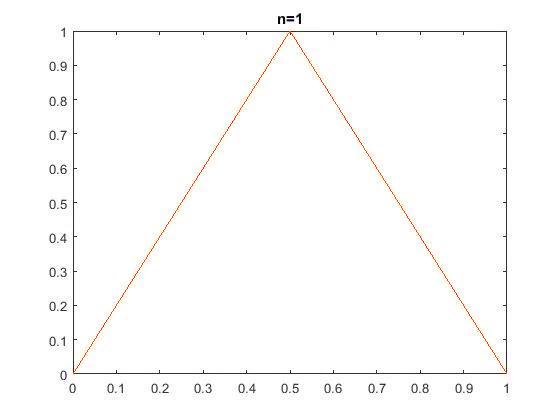
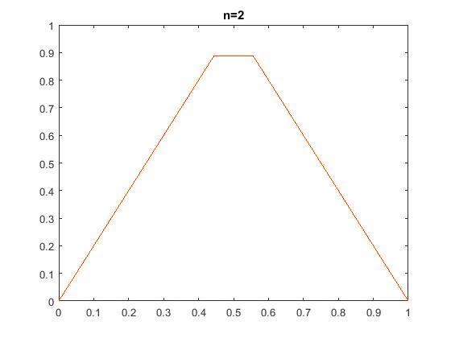
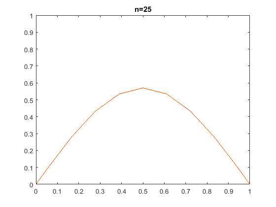
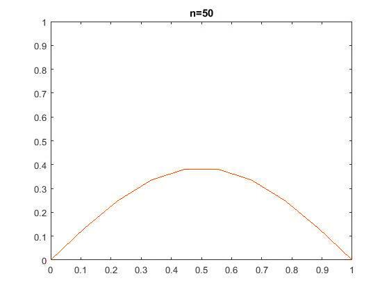
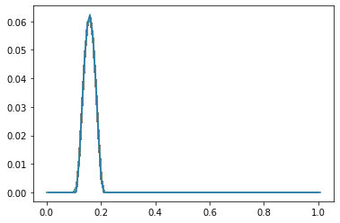
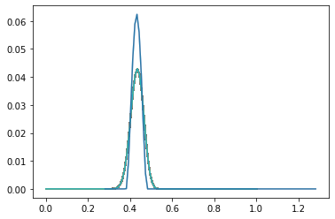
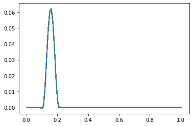

# FEM-implementation-in-CPP
An object oriented approach for solving elliptic PDEs using Finite Element Method.

Example initial mesh

Example refined mesh

# Finite-Difference-Methods

(1) The "Explicit Euler Method" program, solves the trivial parabolic problem, with the following initial conditions:

u(0,x)=2x,   0<=x<=1/2

u(0,x)=2-2x,   1/2<x<=1

(2) The "Upwind Method (2)" and the "Lax Wendroff Method (2)" programs, solve the following initial/boundary problem:

du/dt+2*du/dx=0

u(0,x)=10^4*(0.1-x)^2*(0.2-x)^2,   0.1<x<0.2

u(0,x)=0,   otherwise

u(t,0)=0,   0<=t<=1

Upwind Method

Lax Wendroff Method

(3) The "Implicit Euler Method (3)" and the "Crank Nicolson Method (3)" programs, solve the following initial/boundary problem:

du/dt=(1+x^2)*d^2u/dx^2+u

u(0,x)=sin(pi*x),   -1<=x<=1

u(t,-1)=u(t,1)=0,   0<=t<=1

(4) The "Upwind Method (4)" and the "Lax Wendroff Method (4)" programs, solve the following initial/boundary problem:

du/dt+u*du/dx=0,   0<t<=1, x in R

u(0,x)=exp(-10*(4*x-1)^2),   x in R

# Finite-Element-Methods

Elliptic Problem

Parabolic Problem

